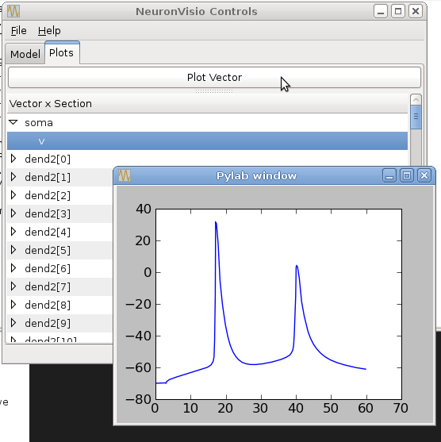
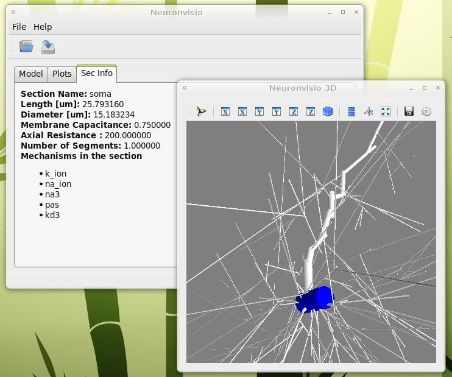

***************
Getting Started
***************

How does it work
================

You need to use Neuronvisio from an ipython_ console started with the qt4 thread switch::

    ipython -q4thread

.. _ipython: http://ipython.scipy.org/

To use the NeuronVisio module, after you have installed you should import with::

    from neuronvisio.controls import Controls 
    controls = Controls()   # starting the GUI

The Control class run the main loop of the application with all the GUI activities
in its own thread. The console is ready for input so you can enter your command to 
the prompt as you would do normally when using _NEURON.

.. NEURON: http://www.neuron.yale.edu/neuron/

How to integrate NeuronVisio with your code
===========================================

The integration is rather simple and you can use either the python or the hoc 
scripts that you already have.

Python integration
------------------

If you have a model written in python, just import the module on top of your 
script. The simple example (in the example directory) give you an idea how to do 
it.

A classical template is::

    from nrnvisio.controls import Controls
    from neuron import h 
    controls = Controls()   # starting the GUI
    # Your model here

Hoc Intergration
----------------

You have to load your hoc script using the python interface of _NEURON. 
The pyramidal example gives an idea how to integrate existent _NEURON model 
with it.

A classical template is::

    from nrnvisio.controls import Controls
    from neuron import h 
    controls = Controls()   # starting the GUI
    h.load_file('path/to/my_model.hoc')

NeuronVisio features
====================

Visualization
-------------

To visualize you model after you loaded you have to click the Plot3d button.

.. image:: images/Neuronvisio_Controls.png
    

The 3D window will open showing your model:
    
.. image:: images/Neuronvisio_3D.png

How to rotate
-------------

Hold the left button and move the mouse.

How to zoom
-----------

Use your mouse's wheel or the right button of the mouse.

How to move
-----------

Hold the wheel down and move the mouse.

Plotting the simulation results
===============================

Creating the vectors
--------------------

To plot the simulation's results you first have to create a Vector 
(or more than one) to record the variable that you are interested in.

For example if you are interested in the voltage you have to insert `v` 
in the 'Variable to record` and click `Create Vector`. 

.. image:: images/Neuronvisio_Controls_selecting_variable.png

Run the simulation
------------------

The simulation can be run clicking on the `Init & Run` button. 
It will run until the tstop.

.. image:: images/Neuronvisio_Controls_Init_and_Run.png
    
    
Plotting the simulation
-----------------------

To plot the results click on the tab 'Plots' and select the variable 
from the section you want to plot. Then click `Plot`.

If you want to plot more variables in one go hold `Ctrl` and select as 
many as you want, then click `Plot`

If you want to insert the legend just select the `legend box` 

Investigate the section parameters
==================================

Select a section (Just click over it, near the beginning or the end of the cylinder) 
and the section info will be displayed in the Sec Info Tab.

    
Loading And Saving the simulation results
=========================================

Neuronvisio can store simulation's results in a sqlite3 database. This is very handy 
when you simulation takes a long time to run and you want to inspect again the results, 
without re-run it.

More over, if you use the manager object to create the vectors, you can access any simulation's
results and explore them with Neuronvisio even of you ran it on a cluster or remote computers. 

To do that you need to:

1. Instantiate the same geometry of the model with which you have ran the simulation
2. Load the database.

Using the manager object to store the results of your simulation
----------------------------------------------------------------

This is a quick example how to save the simulation in neuronvisio::
    
    # Model geometry already instantiated. 
    #   
    from neuronvisio.manager import Manager
    manager = Manager()
    manager.add_all_vecRef('v')
    
    # file where to save the results
    filename = 'storage.sqlite'
    # Saving the vectors
    manager.store_in_db(filename)
    
If you run a lot of simulations you want maybe to run the same script but without rewriting 
the same results. Manager has a nice method to help you called create_new_dir::
    
    saving_dir = manager.create_new_dir() # Create a new dir per Simulation, ordered by Day.
    db_name = 'storage.sqlite'
    filename = os.path.join(saving_dir, db_name)
    # Saving the vectors
    manager.store_in_db(filename)

Loading a previous simulation
-----------------------------

To load the simulation results you need to reload the same kind of geometry.
A Classic approach will be::
    
    from neuronvisio.controls import Controls
    
    # reload your model here
    
    controls = Controls()
    
    # Now you can use the gui, or do it by console.
    # Using the gui, click on the Load button.
    
    # Loading the db by code
    
    controls.load_db(path_to_sql_db) # Loading the db
    