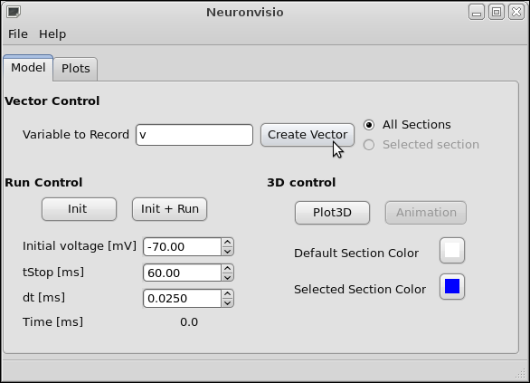
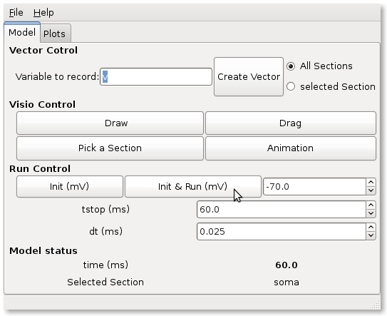

***************
Getting Started
***************

How does it work
================

You need to use NeuronVisio from an _ipython console started with the 
pylab switch::

    ipython -pylab

.. _ipython: http://ipython.scipy.org/

To use the NeuronVisio module, after you have installed you should import with::

    from neuronvisio.controls import Controls 
    controls = Controls()   # starting the GUI

The Control class run the main loop of the application with all the GUI activities
in its own thread. The console is ready for input so you can enter your command to 
the prompt as you would do normally when using _NEURON.

.. NEURON: http://www.neuron.yale.edu/neuron/

How to integrate NeuronVisio with your code
===========================================

The integration is rather simple and you can use either the python or the hoc 
scripts that you already have.

Python integration
------------------

If you have a model written in python, just import the module on top of your 
script. The simple example (in the example directory) give you an idea how to do 
it.

A classical template is::

    from nrnvisio.controls import Controls 
    controls = Controls()   # starting the GUI
    from neuron import h
    # Your model here

Hoc Intergration
----------------

You have to load your hoc script using the python interface of _NEURON. 
The pyramidal example gives an idea how to integrate existent _NEURON model 
with it.

A classical template is::

    import nrnvisio
    from neuron import h
    controls = nrnvisio.Controls()
    h.load_file('path/to/my_model.hoc')

NeuronVisio features
====================

Visualization
-------------

To visualize you model after you loaded you have to click the Draw button.

.. image: images/NeuronVisio_Controls.png
    :scale: 50

How to rotate
-------------

Hold the third button of your mouse (usually clicking the wheel) and move 
the mouse.

How to zoom
-----------

Hold the right button of your mouse and move the mouse.

How to move
-----------

Click on `Drag` button and then pick a section of your model to move it.

.. image: images/NeuronVisio_Controls_Drag.png
    :scale: 50

Plotting the simulation results
===============================

Creating the vectors
--------------------

To plot the simulation's results you first have to create a Vector 
(or more than one) to record the variable that you are interested in.

For example if you are interested in the voltage you have to insert `v` 
in the 'Variable to record and click record'. 

If you want to create a vector for only one section just pick that 
section clicking on 'Pick a Section' and then select the section on the GUI.

.. image::images/pick_section.png
    :scale: 70

Run the simulation
------------------

The simulation can be run clicking on the `Init & Run` button. 
It will run until the tstop.

    
Plotting the simulation
-----------------------

To plot the results click on the tab 'Plots' and select the variable 
from the section you want to plot. Then click `Plot`.

If you want to plot more variables in one go hold `Ctrl` and select as 
many as you want, then click `Plot`

If you want to insert the legend just select the `legend box` 

.. image:: images/plotting_variable.png
    :scale: 70
