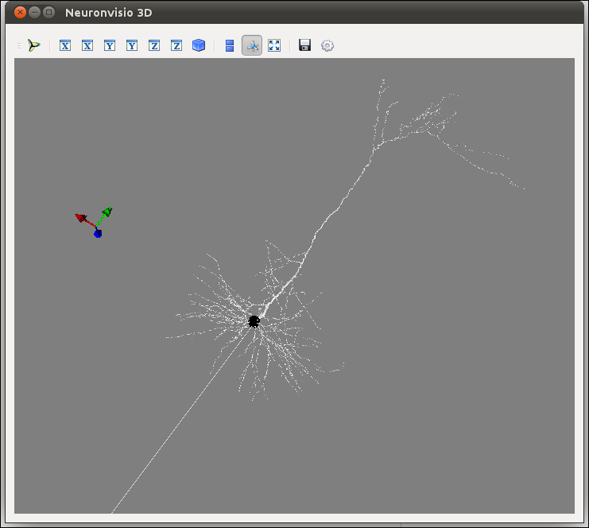
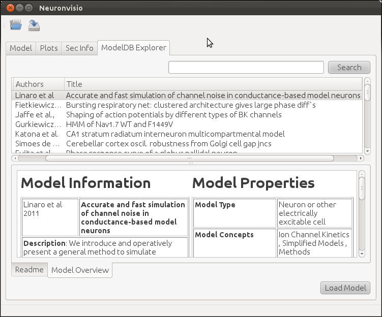

.. _getting started:

***************
Getting Started
***************

How does it work
================

To run Neuronvisio you can either use the provided `neuronvisio` executable,
which will create an ipython_ session::

    $ neuronvisio

.. _ipython: http://ipython.org/

.. note:: On windows, you can launch it with `neuronvisio.bat` 

or you can start ipython and load neuronvisio from within your script, 
as explained in section `How to integrate Neuronvisio with your code`_ 

To load Neuronvisio just paste this two lines in ipython::

    from neuronvisio.controls import Controls 
    controls = Controls()   # starting the GUI

The Control class run the main loop of the application with all the GUI activities
in its own thread. The console is ready for input so you can enter your command to 
the prompt as you would do normally when using NEURON_.

.. _NEURON: http://www.neuron.yale.edu/neuron/

.. _loading-a-file: 

Loading a file
--------------

You can also load 3 different formats right now:

1. A NeuroML file (.xml)
2. A NEURON hoc file hoc file (.hoc)
3. A HDF file formatted according to Neuronvisio format, (.h5). Check `storage`.  

to load any of them just pass it as an argument::

	$ neuronvisio path/to/my/file.hoc (or .h5, or .xml)

.. note: The import of the NeuroML is done using the current NeuroML importer facilities provided with NEURON, which they are not working all the time. When released, we will switch to libNeuroML_. 

.. _libNeuroML: https://github.com/NeuralEnsemble/libNeuroML

How to integrate Neuronvisio with your code
===========================================

The integration is rather simple and you can use either the python or the hoc 
scripts that you already have.

.. _python-integration:

Python integration
------------------

If you have a model written in python, just import the module on top of your 
script. The simple example (in the example directory) give you an idea how to do 
it.

A classical template is::

    from neuronvisio.controls import Controls
    from neuron import h 
    controls = Controls()   # starting the GUI
    # Your model here

.. _hoc-integration:

Hoc Intergration
----------------

You have to load your hoc script using the python interface of _NEURON. 
The pyramidal example gives an idea how to integrate existent _NEURON model 
with it.

A classical template is::

    from neuronvisio.controls import Controls
    from neuron import h 
    controls = Controls()   # starting the GUI
    h.load_file('path/to/my_model.hoc')

Neuronvisio features
====================

Visualization
-------------

To visualize you model after you loaded you have to click the Plot3d button.

.. image:: _static/neuronvisio_main_control.png
    

The 3D window will open showing your model:
    

How to rotate
-------------

Hold the left button and move the mouse.

How to zoom
-----------

Use your mouse's wheel or the right button of the mouse.

How to move
-----------

Hold the wheel down and move the mouse.

Plotting the simulation results
===============================

Creating the vectors
--------------------

To plot the simulation's results you first have to create a Vector 
(or more than one) to record the variable that you are interested in.

For example if you are interested in the voltage you have to insert `v` 
in the 'Variable to record` and click `Create Vector`. 

.. image:: _static/neuronvisio_main_control.png

Run the simulation
------------------

The simulation can be run clicking on the `Init & Run` button. 
It will run until the tstop.

.. image:: _static/neuronvisio_main_control.png
    
    
Plotting the simulation
-----------------------

To plot the results click on the tab 'Plots' and select the variable 
from the section you want to plot. Then click `Plot`.

If you want to plot more variables in one go hold `Ctrl` and select as 
many as you want, then click `Plot`

If you want to insert the legend just select the `legend box` 

.. image:: _static/plotting_vector_results.png
    :scale: 70

Investigate the section parameters
==================================

Select a section (Just click over it) and the section info 
will be displayed in the Sec Info Tab.

.. image:: _static/Neuronvisio_sec_info.png
    :scale: 80
    
ModelDB Integration
===================

This section describe how to load a model from ModelDb in Neuronvisio, 
and how to get the latest model from the ModelDB, if they are not 
already present in the ModelDB XML list.

Browsing the NEURON models from ModelDB
---------------------------------------

ModelDB database is a lightly curated repository of computational models,
published in litterature http://senselab.med.yale.edu/ModelDB/. While 
ModelDB accepts models in a variety of format, a large subset is formed 
by models stored in NEURON format. The ModelDB NEURON’s model are stored 
in an XML file, which comes with Neuronvisio source code. The file is 
parsed at run time and the content is loaded in a Qt tree widget, 
available in the ModelDB explorer tab.
 
It is possible to browse among all the available models 
per year of publication, authors, title and unique id number. The columns 
can be ordered alphabetically, and it is possible to perform a simple search, 
writing the desired keyword in the search box.

If available, the README associated with the model is displayed, 
together with a custom model overview which summarizes the features of 
the model, enumerating the type of channels used, the cell types, the 
brain region, etc.

Loading a NEURON model from ModelDB
-----------------------------------

Any of the models available on the ModelDB explorer tab can downloaded and extracted. 
The models which have a `mosinit.hoc` will also be compiled and loaded in the current 
session, giving the user the possibility to explore and simulate the model. 

If no `mosinit.hoc` is found, the software will open the folder where the model has been downloaded,
warning the user of the impossibility to load it automatically.

.. note:: if the model does not have a `mosinit.hoc`, Neuronvisio cannot load it, because does not know what to load as master file. You can always load the relevant file following the section :ref:`hoc-integration` or :ref:`python-integration`.

Updating information from ModelDB
---------------------------------

The content of the XML file which is included with each version of 
Neuronvisio is usually up-to-date with the content of ModelDB at the time 
of the release. Updating this file from the online DB can be done by 
manually, if required, by running from any shell the script 
`neuronvisio-modeldb-updater`. Neuronvisio updater will find where the 
current `ModelDB.xml` is stored, and update with the latest items, if any.

.. note:: You need to be able to write on the `ModelDB.xml` location. If you have installed the package as root, you may need to run it as root.

It should be noted that the model extraction from ModelDB is slowed down 
to 1/sec in order to avoid loading the site. Also this process only 
update the file with models which do not exist in the local XML file 
and does not currently refresh the content of existing ones.

Troubleshooting
===============

If you start ipython with the `--pylab=qt` switch and get and error like:: 

    	/usr/local/lib/python2.7/dist-packages/pyface/qt/__init__.py in prepare_pyqt4()
         15     # Set PySide compatible APIs.
    
         16     import sip
    ---> 17     sip.setapi('QString', 2)
         18     sip.setapi('QVariant', 2)
         19 
    
    	ValueError: API 'QString' has already been set to version 1
	 

It means ipython has loaded the PyQt4 using the Version 1 of the API, which
is default on Python 2.7 (Version 2 is default on Python 3.) 

To solve this you can either define the variable `QT_API=pyqt`, e.g. in bash::

    $ export QT_API=pyqt
    $ ipython --pylab=qt
    
Or you can launch ipython without pylab support, load Neuronvisio and then 
load pylab with the magic `%pylab`.

Picking the right backend
-------------------------

If when you try to plot matplotlib segfault, you may have the wrong backend selected. 
Neuronvisio try to set the right backed, but if you start ipython with --pylab, automatically
a bakcend is loaded and we can't change it due to matplotlib technical limitation.

To solve this, just `customize your matplotlibrc`_ downloading the matplotlibrc_, saving 
the file in `.matplotlib/matplotlibrc` and changing the backend to `Qt4Agg`, from:: 

	backend      : GTKAgg

to::

	backend      : Qt4Agg

.. _matplotlibrc: http://matplotlib.sourceforge.net/_static/matplotlibrc
.. _customize your matplotlibrc: http://matplotlib.sourceforge.net/users/customizing.html#customizing-matplotlib