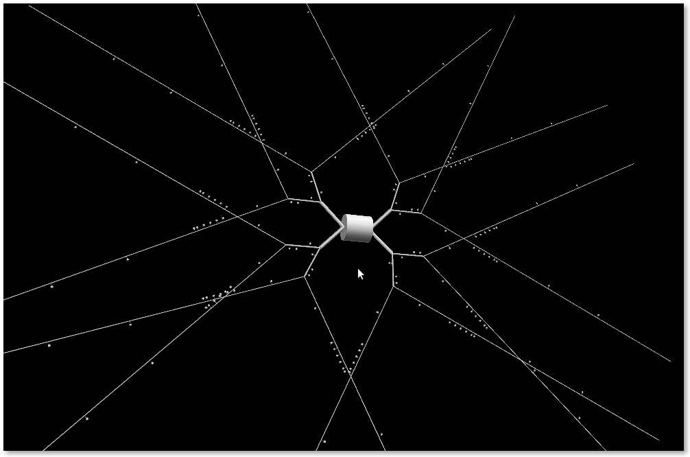
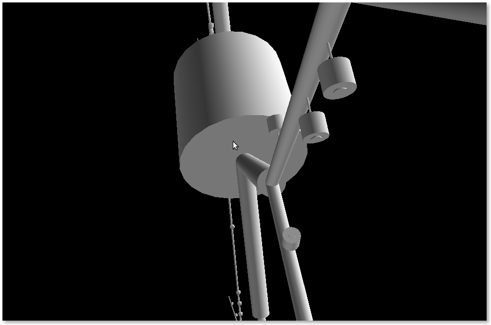

***********
Neuronvisio 
***********

What is it
==========

Neuronvisio is a Graphical User Interface for `NEURON simulator enviroment 
<http://www.neuron.yale.edu/neuron/>`_ with 3D capabilities. Neuronvisio 
makes easy to select and investigate sections' properties and it offers 
easy integration with matplotlib for plotting the results. 

The geometry can be saved using NeuroML and the computational results in 
a customised and extensible HDF5 format; the results can then be reload in the software
and analysed in a later stage, without re-running the simulation.

Features
========

- 3D visualization of the model with the possibility to change it runtime
- Creation of vectors to record any variables present in the section
- Pylab integration to plot directly the result of the simulation
- Exploration of the timecourse of any variable among time using a color coded scale
- Saving the results simulation for later analysis

Quick Links
=========== 

- **Install Neuronvisio:** :ref:`install`
- **Browse the code:** `Github Repo`_
- **Subscribe to the Mailing List:** `Google group`_   
- **Read the docs of any versions:** `Read the docs`_
- **Report an issue:** `Issues tracker`_ 

.. _Google group: http://groups.google.com/group/neuronvisio
.. _github repo:  http://github.com/mattions/neuronvisio
.. _Issues tracker:  http://github.com/mattions/neuronvisio/issues
.. _Read the docs: http://readthedocs.org/docs/neuronvisio/

Quick overview of the 3D capabilites. More :ref:`screenshots`. 

A zoomed version:

Contents
========

.. toctree::
    :maxdepth: 2
    
    install
    gettingstarted
    storage
    screenshots
    reference
    changes
    
Indices and tables
==================

* :ref:`genindex`
* :ref:`modindex`
* :ref:`search`
