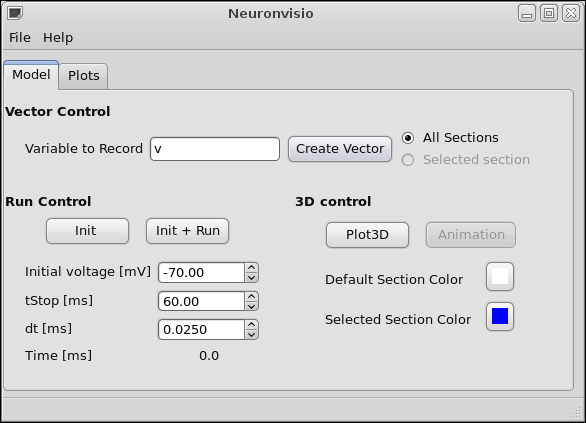
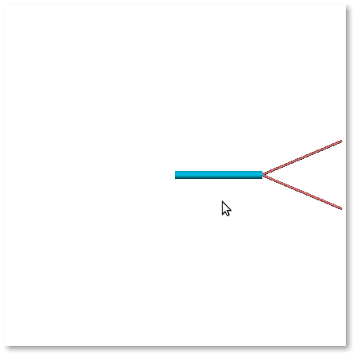

.. _screenshots:

***********
Screenshots
***********

Everybody loves screenshots so here we go.

Gtk GUI control
===============

This is the Controls window. You can create vectors and run simulations. The time shows 
you the time of the NEURON_ simulator.

.. _NEURON: http://www.neuron.yale.edu/neuron/ 

You can change the `tstop`, the `dt` and the initial voltage from the GUI or 
the console.

3-Dimensions with a simple model
================================

Rendering of a simple model with 3 section.

.. image:: images/Simple_model.png

The colors can be changed by the user.

3-Dimensions with a complex model
=================================

Rendering of a more complex model, a pyramidal neuron.

.. image:: images/Neuronvisio_3D.png
    :scale: 70

Animation window and pylab graph
================================

The animation window and the pylab graph, showing the variation of the voltage 
in the soma and the behaviour of the same variable through the cell.

Simple model
------------

A simple 3 sections model showing the different value of the voltage in the cell.

.. image:: images/voltage_variation_among_time.png
    :scale: 70

Pyramidal neuron
----------------

The propagation of the voltage among the neuron. The stimul was given in the soma.

.. image:: images/pyramidal_3D_change_voltage.png
    :scale: 70

Pylab integration
-----------------

It is possible to use the standard pylab tool and to decide in which figure to 
plot the curve.

.. image:: images/pylab_integration.png
    :scale: 70