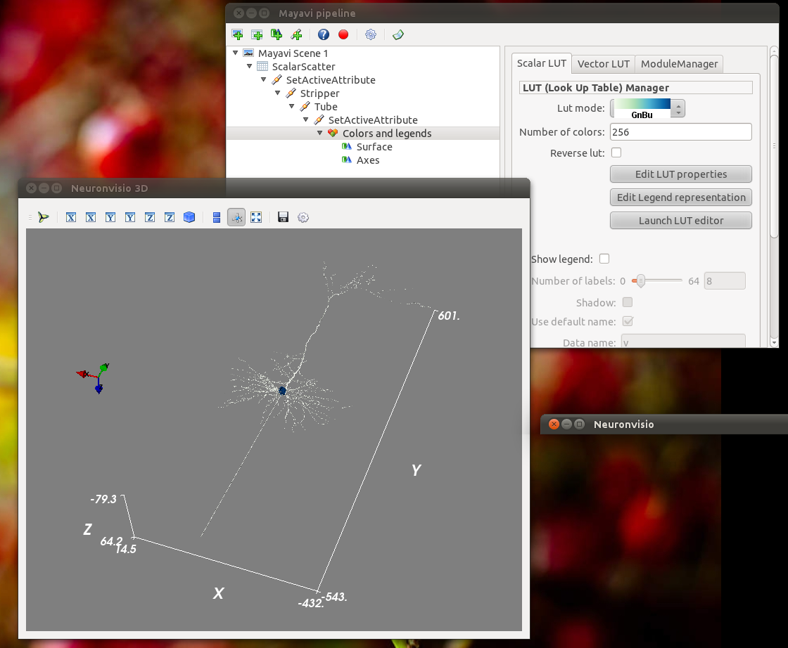
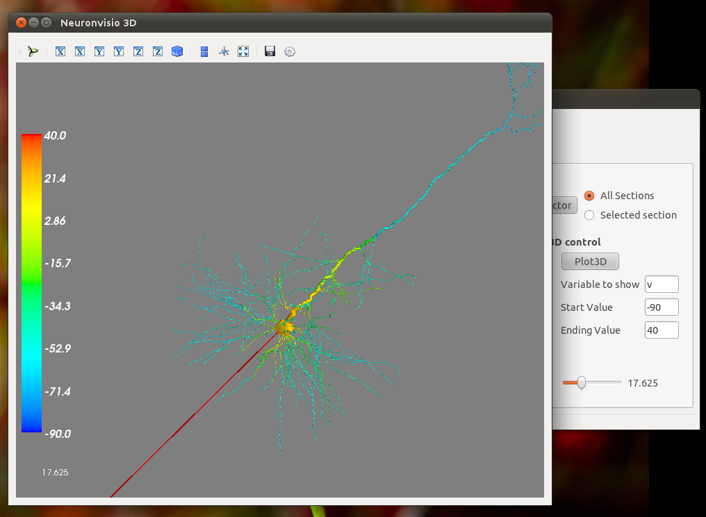

.. _screenshots:

***********
Screenshots
***********

Everybody loves screenshots, so here we go. 

*Notice: Some of the screenshots are missing the modelDB tabs, 'cause 
the functionality was added at later stage. We decided to keep them,
'cause they are stil informative to what you can do with Neuronvisio.* 

GUI control
===========

This is the Controls window. You can create vectors and run simulations. The time shows 
you the time of the NEURON_ simulator.

.. _NEURON: http://www.neuron.yale.edu/neuron/ 

You can change the `tstop`, the `dt` and the initial voltage from the GUI or 
the console.

.. image:: _static/Neuronvisio_Controls_Init_and_Run.png

3-Dimensions with a simple model
================================

Rendering of a simple model with 3 section.

.. image:: _static/Simple_model.png

The neurons is rendered using the Mayavi pipeline, where is possibile to choose
from different colormap and additional filters.
Using the `GnBu` colormap with the Axes.

Using the `red-blue` colormap with the Axes.

.. image:: _static/nrnvisio-mayavi-color2.png
	:scale: 70

3-Dimensions with a complex model
=================================

Rendering of a more complex model, a pyramidal neuron.

.. image:: _static/Neuronvisio_3D.png
    :scale: 70

Timecourse movie and pylab graphs
=================================

It is possible to follow the timecourse of a variable in the whole neuron or 
networks using the bottom slider, after the simulation has been ran, 
or reloaded. If a particular point in time is of interest, insert in the 
animation Time line textfield and hit return.
 
The pylab graphs are integrated and can be easily generated with a click. 
For example here we shows hhow the voltage change in a simple model and in 
a pyramidal one.

Pyramidal neuron
----------------

The propagation of the voltage among the neuron. The stimul was given in the 
soma.

Pylab integration
-----------------

It is possible to use the standard pylab tool and to plot the timecourses in 
the current figure, or create a new one just selecting another output figure 
number.

.. image:: _static/pylab_integration.png
    :scale: 70
    
Making a movie
==============

To make a movie it is possible to call the function::

    controls.make_animation_screenshots(time_start, time_stop=None, 
                                        saving_dir='anim')
    
which will save all the screenshots in brand new directory (default is anim).
To stack them in a movie, you can use ffmpeg with the following command::

    ffmpeg -f image2 -r 10 -i %09d.png -sameq anim.mov -pass 2
    
One of the example video, using the pyrimidal neuron can be seen here: 
http://www.youtube.com/watch?v=LOuptLKZ5rU
