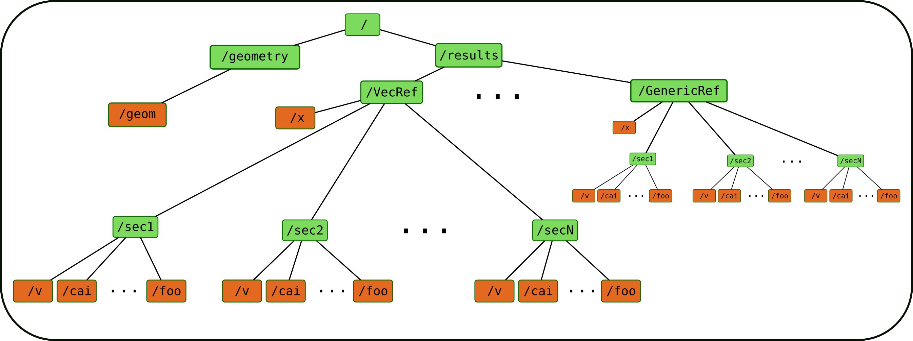

**************************************
Saving and loading simulations' reults
**************************************

HDF structure
=============

Neuronvisio stores simulation's results using the hdf_ standard, using PyTables_  This is very handy 
when you simulation takes a long time to run and you want to inspect again the results, 
without re-run it.

.. _hdf: http://www.hdfgroup.org/
.. _PyTables: http://www.pytables.org

The file has a structure shown in the following images

    
The Refs is the data structure used by Neuronvisio. The `VecRef` is the specialized one. It is possible to add more 
Ref subclassing the :class:`manager.BaseRef`.

Using the manager object to store the results of your simulation
----------------------------------------------------------------

This is a quick example how to save the simulation in neuronvisio::
    
    # Model geometry already instantiated. 
    #   
    from neuronvisio.manager import Manager
    manager = Manager()
    manager.add_all_vecRef('v') # Adding vector for the variable v
    
    # file where to save the results
    filename = 'storage.h5'
    # Saving the vectors
    manager.save_to_hdf(filename)
    
If you run a lot of simulations you want maybe to run the same script but without rewriting 
the same results. Manager has a nice method to help you called create_new_dir::
    
    saving_dir = manager.create_new_dir() # Create a new dir per Simulation, ordered by Day.
    hdf_name = 'storage.h5'
    filename = os.path.join(saving_dir, hdf_name)
    # Saving the vectors
    manager.save_to_hdf(filename)

Loading a previous simulation
-----------------------------

To load the results of a simulation you can start neuronvisio giving the path_to_the_hdf_file::

    $ nrnvisio path/to/storage.h5
    
or you can just start neuronvisio and use the Load button::

    $ nrnvisio

Saving your variables in storage.h5 and use Neuronvisio to plot them 
====================================================================

The `BaseRef` can be used to store computational results which are not in NEURON
vectors format. Every BaseRef object is contained in a group, which is specified 
by the `group_id` attribute. The group_id is than used by Neuronvisio to pair the
saved vectors with the time vectors which is required to plot.

To subclass the BaseRef just create a class::

    from neuronvisio.manager import BaseRef 
    
    class MyRef(BaseRef):
        
        def __init__(self, sec_name=None, vecs=None, detail=None):
            
            BaseRef.__init__(self)
            self.group_id = 'MyGroup'
            self.sec_name = sec_name
            self.vecs = vecs
            self.detail = detail

Then you can create it::

    myRef = MyRef(sec_name=sec_name, 
                  vecs=vecs,
                  detail=detail)
        
`sec_name` should be the name of the section where the variable is been recorded, 
vecs is a dictionary with the variable name as key and the python_list with the 
computed value. A numpy array or an HocVector is also accepted.

After that you can add to the manager using the `manager.add_ref` which takes two 
arguments:

    - the myRef object
    - the x variable.
    
The x variable is the independent one, usually the time, which will be used to plot the from the 
Neuronvisio graphical interface. If don't need to supply your own time vector, because is the 
same of the main NEURON one, you can use the `manager.groups['t']` which will return the 
NEURON time array::
 
    manager.add_ref(timeseriesRef, x)

All together is::

    class MyRef(BaseRef):
    
        def __init__(self, sec_name=None, vecs=None, detail=None):
            
            BaseRef.__init__(self)
            self.sec_name = sec_name
            self.vecs = vecs
            self.detail = detail
    
    
    myRef = MyRef(sec_name=sec_name, 
              vecs=vecs,
              detail=detail)
    manager.add_ref(myRef, x)
                  
Then you just need to save the file where is more convenient for you::
    
    filename = 'storage.h5'
    # Saving the vectors
    manager.save_to_hdf(filename)

When you reload the simulation you will have your variables back        

.. image:: images/Neuronvisio_Refs.png